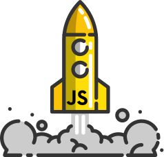

<h1 align="center">
   
  
   
</h1>

<h3 align="center">Iniciando com Javascript 😶‍🌫️</h3>

Neste projeto inicio o estudo mais focado de Javascript, onde acompanho cursos e outros materiais como ferramenta base de conhecimento.

[✔️] - Manipulação de variáveis 
[ ] - Comandos de entrada 
[ ] - Entendendo funções 
[ ] - Trabalhando com arrays 
[ ] - Manipulando arrays 
[ ] - Aprendendo loops 
[ ] - Conhecendo switch 
[ ] - Manipulando datas 
[ ] - Praticando conhecimentos
